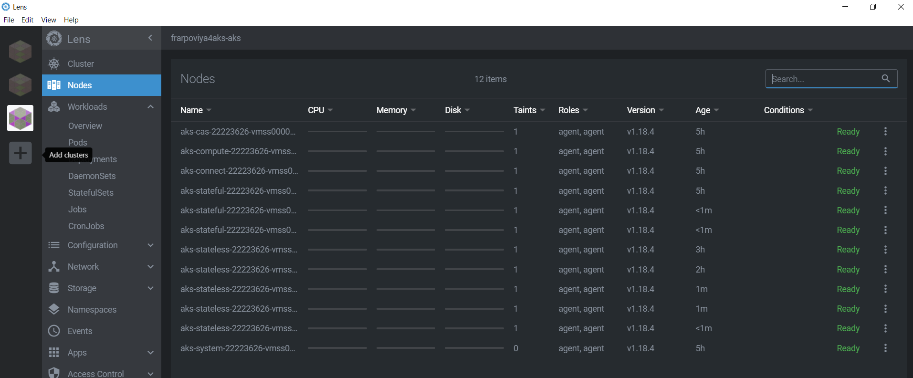
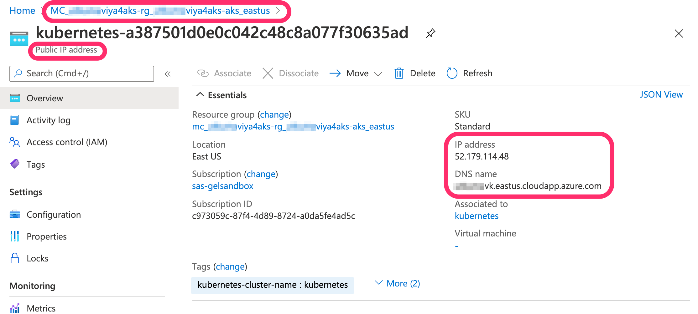
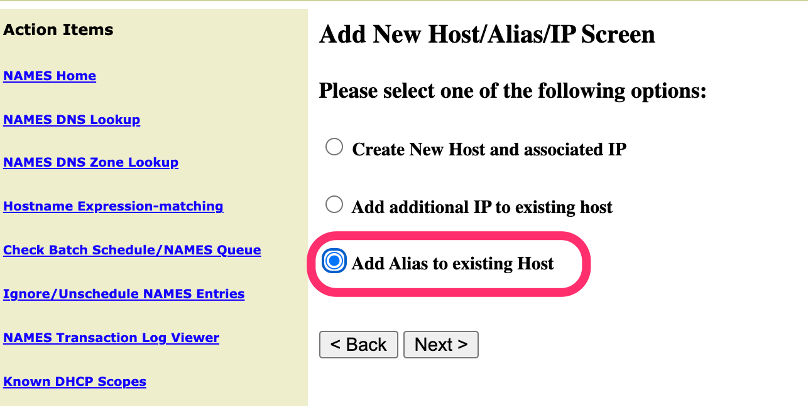
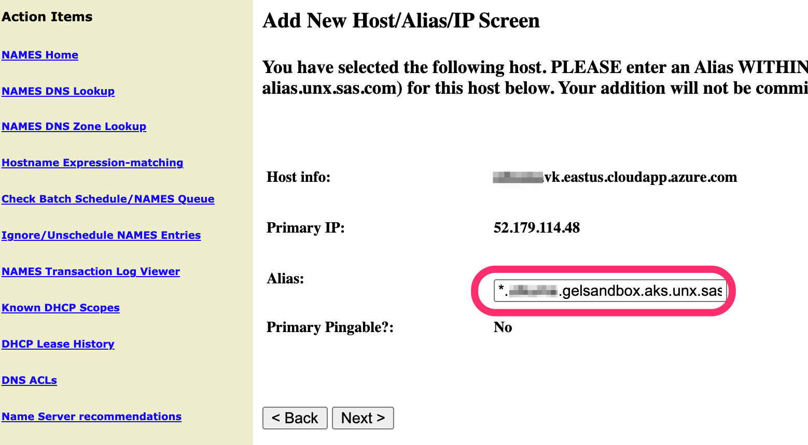
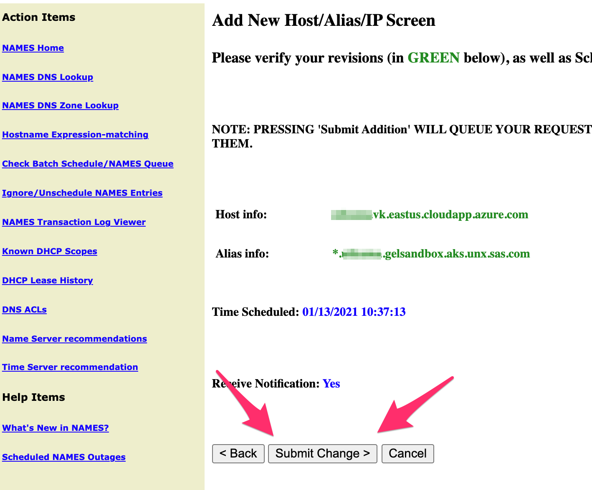

# Optional : Deploy and start a second Viya Environment

* [Create the namespace for prod](#create-the-namespace-for-prod)
* [Use the non-default name for the external postgresDB](#use-the-non-default-name-for-the-external-postgresdb)
* [Prepare another kustomize file for prod](#prepare-another-kustomize-file-for-prod)
* [Watch the cluster autoscaling](#watch-the-cluster-autoscaling)
* [Deploy the PROD Viya environment](#deploy-the-prod-viya-environment)
* [Check the new Nodes](#check-the-new-nodes)
* [Check the new PostgreSQL Database](#check-the-new-postgresql-database)
* [Provide a CNAME for the second Viya environment](#provide-a-cname-for-the-second-viya-environment)
  * [Create a wildcard DNS alias](#create-a-wildcard-dns-alias)
  * [Update Viya to respond to the new Alias](#update-viya-to-respond-to-the-new-alias)
* [Delete the namespace prod](#delete-the-namespace-prod)
* [Navigation](#navigation)

Thanks to the concept of Kubernetes namespaces, it is very easy to deploy another Viya environment in the same AKS cluster.
As we will see the only real challenge is on the Ingress controller.

Let's see how to deploy another Viya Environment in the "prod" namespace.

## Create the namespace for prod

* Run the command below to create a new namespace called "prod"

    ```sh
    kubectl create ns prod
    ```

## Use the non-default name for the external postgresDB

Reference : <https://rndconfluence.sas.com/confluence/display/RNDDEVOPS/Multiple+Namespace+Deployment+with+Single+External+PG>

* We want to use the same external PostgreSQL server to host both environment SAS Data Server infrastructure. The default database name is 'SharedServices'.

* In order to create multiple databases on a single external PG server, we need to use different database name per each deployment.

* For now, we need to update/add 3 parts in kustomization.yaml : sas-shared-config, sas-postgres-config and sas-go-config

## Prepare another kustomize file for prod

* We need to use the new namespace name, the new ingress and adjust the sas-shared-config, sas-postgres-config and sas-go-config parts to allow the new deployment to utilize a different PG Database (from the one already created and use for the test deployment). The PG database used for the "prod" namespace will be named "SharedServicesPROD".

    ```sh
    mkdir -p ~/clouddrive/project/deploy/prod
    cd ~/clouddrive/project/deploy/prod

    INGRESS_SUFFIX=prod.$(cat ~/student.txt).$(cat ~/azureregion.txt).cloudapp.azure.com
    cat > ~/clouddrive/project/deploy/prod/kustomization.yaml <<-EOF
    ---
    namespace: prod
    resources:
      - ../test

    configMapGenerator:
      - name: ingress-input
        behavior: merge
        literals:
          - INGRESS_HOST=${INGRESS_SUFFIX}


      - name: sas-shared-config
        behavior: merge
        literals:
          - SAS_SERVICES_URL=https://${INGRESS_SUFFIX}
          - SAS_DATABASE_DATABASE=SharedServicesPROD

      - name: sas-postgres-config
        behavior: merge
        literals:
          - DATABASE_HOST=${STUDENT}viya4aks-pgsql.postgres.database.azure.com
          - DATABASE_PORT=5432
          - DATABASE_SSL_ENABLED="true"
          - DATABASE_NAME=SharedServicesPROD
          - EXTERNAL_DATABASE="true"
          - SAS_DATABASE_DATABASESERVERNAME="postgres"

      - name: sas-go-config
        behavior: merge
        literals:
        - SAS_DATABASE_DATABASE=SharedServicesPROD
    EOF
    cd ~/clouddrive/project/deploy/prod
    # Build the PROD manifests
    kustomize build -o site.yaml
    ```

Caveat is that if you change "test", those changes will also apply to "prod" if you re-build and re-apply the manifests for it.

## Watch the cluster autoscaling

You might have not noticed it yet but we configured our Terraform template in a way that our AKS cluster is using quite small VMs (all our instance type comes with only 4 vcpu). Also we start with only one VM per Node pool (1 VM for CAS, 1 for stateless, 1 for stateful, etc...).
Of course it will not be enough to have a running Viya 4 environment. But the AKS cluster will automatically scale out to accomoadate the pod requests.

When we start the deployment we have only 6 VMs (one by node pool), but at the end additional nodes have been automatically provisionned to match the pods workload requests thanks to the Azure auto-scaler.

The benefit of that is that as long as we don't start the Viya environment, the cost remains limited also when we stop viya (by scaling down to 0 all our pods), then the AKS cluster will adjust the infrastructure by scaling down the number of Azure VMs to match with the Kubernetes cluster workload current request (without loosing the user content thanks to the Persistent Volumes).

* Now before deploying a secondary Viya environment, let's see how many nodes we have for now

   

## Deploy the PROD Viya environment

* Now let's deploy another Viya in the new namespace.

    ```sh
    cd ~/clouddrive/project/deploy/prod
    kubectl apply -f site.yaml -n prod
    ```

* While the pods are starting in the "prod" namespace, you can monitor the pods and watch the number of nodes in Lens.

  

* You can also running this command in your Azure Cloud Shell:

    ```sh
    watch "kubectl get nodes -o wide"
    ```

## Check the new Nodes

* After a little while, you will see the new nodes that have been automatically provisioned by Azure.

  

* You can also see that in the Azure Portal. Click on the "Kubernetes service" resource into your own "Resource Group" (<STUDENT>viya4aks-rg), then on the left menu, select "Scale".

  

* Click on the first line link that sends you to the node pools page. From there you can see the current number of nodes in each pool.

  

* You can see that the maximum number of stateless nodes is set to 5. It means a total of 5x16 GB of RAM, it is likely not enough to run two Viya environment. See if you can increase this number and notice the impact on the Pods in Lens.

## Check the new PostgreSQL Database

* Open the Azure portal and click on the "Azure Database for PostgreSQL Server" resource into your own "Resource Group" (<STUDENT>viya4aks-rg), you should see that a new Database called "SharedServicesPROD" has been created.

  

## Provide a CNAME for the second Viya environment

### Create a wildcard DNS alias

In a customer scenario, you would have to make the second namespace available to the outside world, using the Ingress controller.
To do that we need to have different URL prefixes that could be used to redirect the user queries toward the proper namespace, such as test.sasgelsandbox.
However, in the Azure configuration we can only assign ONE DNS name for the Public IP that was created to access our AKS cluster. (the default one that ends with "cloudapp.com")

In order to serve multiple namespaces deployments to the outside we could either buy our own Domain (from a domain registrar) and use Azure DNS alias records or use the names.sas.com (as explained [there](https://rndconfluence.sas.com/confluence/display/RNDDEVOPS/Multiple+Namespace+Deployment+with+Single+External+PG) and adjust our INGRESS_SUFFIX accordingly in the kustomization.yaml).

Real life customers will likely have their own domains and be in position to request named or wildcard DNS aliases to support as many Viya environments as they want in the same AKS cluster.

We will now illustrate the usage of <https://names.sas.com>. Let's say we have an existing deployment with a kustomization.yaml file containing the following lines:

```yaml
configMapGenerator:
- name: ingress-input
  behavior: merge
  literals:
  - INGRESS_HOST=<YOUR_FullyQualifiedDomainName>
- name: sas-shared-config
  behavior: merge
  literals:
  - SAS_SERVICES_URL=http://<YOUR_FullyQualifiedDomainName>
```

where `<YOUR_FullyQualifiedDomainName>` is the fully qualified domain name associated with the Nginx server. This domain name corresponds to an IP address that will be denoted `YOUR_IP_ADDRESS`.

Assuming you have used the [SAS Viya 4 IaC for Azure Github project](https://github.com/sassoftware/viya4-iac-azure), you should have a public IP resource whose name starts with `kubernetes-` that has the following information:



1. Then, go to <https://names.na.sas.com>, enter your credentials, and select on the Home screen the option to add a new Alias :

    

1. Since we want to add an alias to an existing host, select that option:

    

1. The next screen asks to type the Hostname to which you want to add an Alias, type the `<YOUR_FQDN>` value:

    

1. The next screen asks to type the Alias in the `alias` field. Theoretically, you could type any alias (as long as it is not used/reserved and allowed), but let's stick to some convention:

   `*.<yourSASuserId>.gelsandbox.aks.unx.sas.com`

    where `*` represent anything (it's a wildcard) and `<yourSASuserId>` is your SAS user ID (6 letters).

   Example: `*.canepg.gelsandbox.aks.unx.sas.com`

1. **IMPORTANT**:
   * Make sure you keep the word `gelsandbox` in your alias. This way, we (the GEL team) can periodically clean up those stale aliases out of the DNS! (in case you forget to do it).
   * If you are doing this outside of the workshop, **DO NOT** use the word `gelsandbox` in your alias!

1. Let's note this new alias as `<YOUR_GENERIC_ALIAS>`.

   

1. The next 2 screens are confirmation screens (be sure to read all the information). You also have the possibility to get a confirmation email when the alias creation is done. I suggest you do so.

1. Don't forget to click **Submit** on the last screen:

    

### Update Viya to respond to the new Alias

Once the alias is created, go back to your kustomization.yaml file and replace `<YOUR_FullyQualifiedDomainName>` by `<YOUR_Alias>`:

```yaml
namespace: <YOUR_NAMESPACE>


configMapGenerator:
- name: ingress-input
  behavior: merge
  literals:
  - INGRESS_HOST=<YOUR_ALIAS>
- name: sas-shared-config
  behavior: merge
  literals:
  - SAS_SERVICES_URL=http://<YOUR_ALIAS>
```

where `<YOUR_Alias>` could be anything matching the wildcard defined in ´<YOUR_GENERIC_ALIAS>`

Because of the start (`*`) in your CNAME record, any prefix would be valid:

* `prod.canepg.gelsandbox.aks.unx.sas.com`
* `notprod.canepg.gelsandbox.aks.unx.sas.com`
* `whatever.canepg.gelsandbox.aks.unx.sas.com`
* `really.anything.canepg.gelsandbox.aks.unx.sas.com`
* `I.AM.MAKING.A.POINT.HERE.canepg.gelsandbox.aks.unx.sas.com`
* `ok.enough.canepg.gelsandbox.aks.unx.sas.com`

Using this method, you can now create as many distinct environment in your kubernetes cluster as you want, and you'll have an infinity of names for them.

Once your `kustomization.yaml` has been updated with the desired Alias, make sure to re-build and re-apply the `site.yaml`, in order to update all the ingress definitions.

<!-- There are a few solutions. But it is outside of our current scope.

#### Create another DNS alias for the new namespace

* We use the same IP address but we need to use another DNS that we will configure in kustomize, so the ingress controller will know it must send the request to the new namespace services.

  ```sh
  az network dns record-set cname set-record --resource-group ${STUDENT}viya4aks-rg --zone-name contoso.com --record-set-name test-cname --cname www.contoso.com
  ``` -->

## Delete the namespace prod

* Run this command to get rid of all the resources in the prod namespace

    ```sh
    kubectl delete ns prod
    ```

* With lens, you should see very quickly that the pods are not running any longer.

  

In addition, after 10 minutes, the number of nodes, should also drop.

## Navigation

<!-- startnav -->
* [01 Introduction / 01 031 Booking a Lab Environment for the Workshop](/01_Introduction/01_031_Booking_a_Lab_Environment_for_the_Workshop.md)
* [01 Introduction / 01 032 Assess Readiness of Lab Environment](/01_Introduction/01_032_Assess_Readiness_of_Lab_Environment.md)
* [01 Introduction / 01 033 CheatCodes](/01_Introduction/01_033_CheatCodes.md)
* [02 Kubernetes and Containers Fundamentals / 02 131 Learning about Namespaces](/02_Kubernetes_and_Containers_Fundamentals/02_131_Learning_about_Namespaces.md)
* [03 Viya 4 Software Specifics / 03 011 Looking at a Viya 4 environment with Visual Tools DEMO](/03_Viya_4_Software_Specifics/03_011_Looking_at_a_Viya_4_environment_with_Visual_Tools_DEMO.md)
* [03 Viya 4 Software Specifics / 03 051 Create your own Viya order](/03_Viya_4_Software_Specifics/03_051_Create_your_own_Viya_order.md)
* [03 Viya 4 Software Specifics / 03 056 Getting the order with the CLI](/03_Viya_4_Software_Specifics/03_056_Getting_the_order_with_the_CLI.md)
* [04 Pre Requisites / 04 081 Pre Requisites automation with Viya4-ARK](/04_Pre-Requisites/04_081_Pre-Requisites_automation_with_Viya4-ARK.md)
* [05 Deployment tools / 05 121 Setup a Windows Client Machine](/05_Deployment_tools/05_121_Setup_a_Windows_Client_Machine.md)
* [06 Deployment Steps / 06 031 Deploying a simple environment](/06_Deployment_Steps/06_031_Deploying_a_simple_environment.md)
* [06 Deployment Steps / 06 051 Deploying Viya with Authentication](/06_Deployment_Steps/06_051_Deploying_Viya_with_Authentication.md)
* [06 Deployment Steps / 06 061 Deploying in a second namespace](/06_Deployment_Steps/06_061_Deploying_in_a_second_namespace.md)
* [06 Deployment Steps / 06 071 Removing Viya deployments](/06_Deployment_Steps/06_071_Removing_Viya_deployments.md)
* [06 Deployment Steps / 06 081 Deploying a programing only environment](/06_Deployment_Steps/06_081_Deploying_a_programing-only_environment.md)
* [07 Deployment Customizations / 07 021 Configuring SASWORK](/07_Deployment_Customizations/07_021_Configuring_SASWORK.md)
* [07 Deployment Customizations / 07 051 Adding a local registry to k8s](/07_Deployment_Customizations/07_051_Adding_a_local_registry_to_k8s.md)
* [07 Deployment Customizations / 07 052 Using mirror manager to populate the local registry](/07_Deployment_Customizations/07_052_Using_mirror_manager_to_populate_the_local_registry.md)
* [07 Deployment Customizations / 07 053 Deploy from local registry](/07_Deployment_Customizations/07_053_Deploy_from_local_registry.md)
* [07 Deployment Customizations / 07 091 Configure SAS ACCESS Engine](/07_Deployment_Customizations/07_091_Configure_SAS_ACCESS_Engine.md)
* [07 Deployment Customizations / 07 101 Configure SAS ACCESS TO HADOOP](/07_Deployment_Customizations/07_101_Configure_SAS_ACCESS_TO_HADOOP.md)
* [07 Deployment Customizations / 07 102 Parralel loading with EP for Hadoop](/07_Deployment_Customizations/07_102_Parralel_loading_with_EP_for_Hadoop.md)
* [11 Azure AKS Deployment / 11 011 Creating an AKS Cluster](/11_Azure_AKS_Deployment/11_011_Creating_an_AKS_Cluster.md)
* [11 Azure AKS Deployment / 11 041 Performing Prereqs in AKS](/11_Azure_AKS_Deployment/11_041_Performing_Prereqs_in_AKS.md)
* [11 Azure AKS Deployment / 11 042 Deploying Viya 4 on AKS](/11_Azure_AKS_Deployment/11_042_Deploying_Viya_4_on_AKS.md)
* [11 Azure AKS Deployment / 11 043 Deploy a second namespace in AKS](/11_Azure_AKS_Deployment/11_043_Deploy_a_second_namespace_in_AKS.md)**<-- you are here**
* [11 Azure AKS Deployment / 11 051 CAS Customizations](/11_Azure_AKS_Deployment/11_051_CAS_Customizations.md)
* [11 Azure AKS Deployment / 11 061 Install monitoring and logging](/11_Azure_AKS_Deployment/11_061_Install_monitoring_and_logging.md)
* [11 Azure AKS Deployment / 11 091 Deleting the AKS Cluster](/11_Azure_AKS_Deployment/11_091_Deleting_the_AKS_Cluster.md)
* [11 Azure AKS Deployment / 11 099 Fast track with cheatcodes](/11_Azure_AKS_Deployment/11_099_Fast_track_with_cheatcodes.md)
<!-- endnav -->
