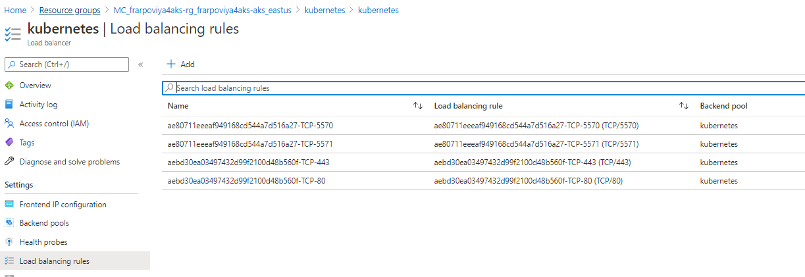
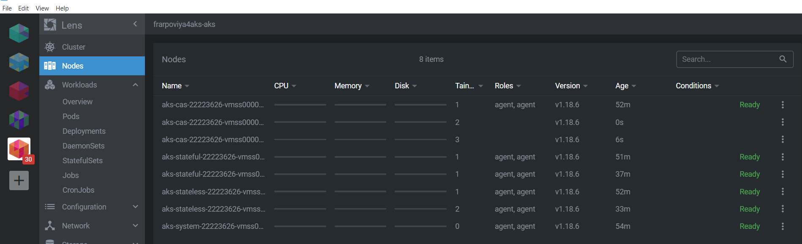

* [Customization 1 : Expose port 5570 for CAS external access](#customization-1--expose-port-5570-for-cas-external-access)
  * [Create a new CAS service to expose CAS ports](#create-a-new-cas-service-to-expose-cas-ports)
  * [Create a DNS alias name for the CAS service](#create-a-dns-alias-name-for-the-cas-service)
  * [Configuration of Server Certificate Attributes](#configuration-of-server-certificate-attributes)
  * [Configure CAS authentication to Cloudnative](#configure-cas-authentication-to-cloudnative)
  * [Rebuild the manifest and update the environment](#rebuild-the-manifest-and-update-the-environment)
  * [Make sure the environment is ready for python connection test](#make-sure-the-environment-is-ready-for-python-connection-test)
  * [Connect to CAS from Python](#connect-to-cas-from-python)
  * [Troubleshooting](#troubleshooting)
* [Customization 2 : Force CAS Worker to run on different nodes](#customization-2--force-cas-worker-to-run-on-different-nodes)
  * [Increase the CAS Pods CPU request](#increase-the-cas-pods-cpu-request)
  * [Validate](#validate)
* [Customization 3 : Use Azure Fast Ephemeral storage for CAS Disk Cache](#customization-3--use-azure-fast-ephemeral-storage-for-cas-disk-cache)
  * [Redeploy with LSv2 Azure instances for the CAS nodes](#redeploy-with-lsv2-azure-instances-for-the-cas-nodes)
  * [Mount and Stripe NVMe Drives (ephemeral storage)](#mount-and-stripe-nvme-drives-ephemeral-storage)
  * [Kustomizations for the new CAS DISK CACHE location](#kustomizations-for-the-new-cas-disk-cache-location)
  * [Test it](#test-it)
* [Navigation](#navigation)

## Customization 1 : Expose port 5570 for CAS external access

### Create a new CAS service to expose CAS ports

* First we prepare a manifest to create a new service to expose the CAS Controller

    ```sh
    #CLOUDSHELLIP=$(curl ifconfig.me)/32
    CLOUDSHELLIP=$(dig +short myip.opendns.com @resolver1.opendns.com)/32
    cat > ~/clouddrive/project/deploy/test/CASlb.yaml << EOF
    ---
    apiVersion: v1
    kind: Service
    metadata:
        labels:
            app.kubernetes.io/instance: default
        name: sas-cas-server-default-lb
    spec:
        ports:
        - name: cas-cal
          port: 5570
          protocol: TCP
          targetPort: 5570
        - name: cas-gc
          port: 5571
          protocol: TCP
          targetPort: 5571
        selector:
            casoperator.sas.com/node-type: controller
            casoperator.sas.com/server: default
        type: "LoadBalancer"
        loadBalancerSourceRanges:
        - 149.173.0.0/16 #Cary
        - 109.232.56.224/27 #Marlow
        - 71.135.5.0/16 # Rob s VPN
        - $CLOUDSHELLIP #Azure Shell
    ---
    EOF
    ```

* Now, let's apply the manifest

    ```sh
    kubectl -n test apply -f  ~/clouddrive/project/deploy/test/CASlb.yaml
    kubectl -n test get svc | grep Load
    ```

* Check in the Azure Portal

Back to the Azure portal, you can notice that a new Public IP has been created


You can also notice the creation of two new rules in the load-balancer configuration:



### Create a DNS alias name for the CAS service

Let's use the Azure CLI to associate the DNS to the newly created Public IP address.

* First we need to get the LB Public IP id (as defined in the Azure Cloud).

  <!--
  ```sh
  # before creating the CAS DNS alias, we need to let some time for azure to create the public IP after we applied the ingress manifest
  sleep 30
  ```
  -->

  ```sh
  STUDENT=$(cat ~/student.txt)
  # get the LB Public IP id (as defined in the Azure Cloud)
  CASPublicIPId=$(az resource list --query "[?type=='Microsoft.Network/publicIPAddresses' && tags.service == 'test/sas-cas-server-default-lb'].id" --output tsv)
  echo $CASPublicIPId
  ```

  _Note : The provisioning of the new public IP, triggered by the previous step (service creation) can take a bit of time and the CASPublicIPId variable can only be obtained once the new public IP has been created in Azure. Until then, the CASPublicId is empty._
  _Make sure the $CASPublicIPId variable has a value before proceeding with the next steps._

* Now,  we use the Public IP Id to create and associate a DNS alias:

  ```sh
  #use the Id to associate a DNS alias
  az network public-ip update -g MC_${STUDENT}viya4aks-rg_${STUDENT}viya4aks-aks_$(cat ~/azureregion.txt) \
  --ids $CASPublicIPId --dns-name ${STUDENT}cas
  ```

### Configuration of Server Certificate Attributes

* As TLS is required for the CAS communications we need to add our alias in the certificate SAN DNS entries (so the client can connect with the CA Certificates).

* The file sas-bases/examples/security/customer-provided-merge-sas-certframe-configmap.yaml can be used to add additional SAN DNS entries to the certificates generated by cert-manager.

    ```yaml
    ---
    apiVersion: builtin
    kind: ConfigMapGenerator
    metadata:
      name: sas-certframe-user-config
    behavior: merge
    literals:
    - SAS_CERTIFICATE_DURATION={{ CERTIFICATE_DURATION_IN_HOURS }}
    - SAS_CERTIFICATE_ADDITIONAL_SAN_DNS={{ ADDITIONAL_SAN_DNS_ENTRIES }}
    - SAS_CERTIFICATE_ADDITIONAL_SAN_IP={{ ADDITIONAL_SAN_IP_ENTRIES }}
    ```

* Let's create our own CongiMapGenerator (we only need to change the ADDITIONAL_SAN_DNS_ENTRIES value)

    ```sh
    cat > ~/clouddrive/project/deploy/test/site-config/security/customer-provided-merge-sas-certframe-configmap.yaml << EOF
    ---
    apiVersion: builtin
    kind: ConfigMapGenerator
    metadata:
      name: sas-certframe-user-config
    behavior: merge
    literals:
    - SAS_CERTIFICATE_ADDITIONAL_SAN_DNS=${STUDENT}cas.eastus.cloudapp.azure.com
    EOF
    ```

* Add the path to the file to the generators block of your `kustomization.yaml` file. Here is an example:

    ```yaml
    generators:
    - site-config/security/customer-provided-merge-sas-certframe-configmap.yaml # merges customer provided configuration settings into the sas-certframe-user-config configmap
    ```

* We can automate the change with yq

    ```sh
    printf "
    - command: update
      path: generators[+]
      value:
        site-config/security/customer-provided-merge-sas-certframe-configmap.yaml # merges customer provided configuration settings into the sas-certframe-user-config configmap
    " | $HOME/bin/yq -I 4 w -i -s - ~/clouddrive/project/deploy/test/kustomization.yaml
    ```

So, with this we have added our external DNS alias to the SAN DNS entries.
On a running system you’ll need to restart pods for the sas-certframe init container to trigger and request the new certificate.

### Configure CAS authentication to Cloudnative

* Set the CASCLOUDNATIVE environment variable.

    One way to set the environment variable is to create a patch file

    ```sh
    cat > ~/clouddrive/project/deploy/test/site-config/patches/setCASCLOUDNATIVE.yaml << EOF
    # This block of code is for adding environment variables for the CAS server.
    ---
    apiVersion: builtin
    kind: PatchTransformer
    metadata:
      name: cas-add-environment-variable-cloudnative
    patch: |-
        - op: add
          path: /spec/controllerTemplate/spec/containers/0/env/-
          value:
            name: CASCLOUDNATIVE
            value: "1"
    target:
      group: viya.sas.com
      kind: CASDeployment
      name: .*
      version: v1alpha1
    EOF
    ```

* In the transformers section of the kustomization.yml add the line - site-config/cas-server-default_nfs_mount.yaml

    ```log
    [...]
    transformers:
    [... previous transformers items ...]
    - site-config/patches/setCASCLOUDNATIVE.yaml
    [...]
    ```

* Alternatively, you can run these commands to update your kustomization.yaml file using the yq tool.
* Execute this code to add the CASCLOUDNATIVE settings

    ```sh
    printf "
    - command: update
      path: transformers[+]
      value:
        site-config/patches/setCASCLOUDNATIVE.yaml   ## patch to set CASCLOUDNATIVE
    " | $HOME/bin/yq -I 4 w -i -s - ~/clouddrive/project/deploy/test/kustomization.yaml
    ```

### Rebuild the manifest and update the environment

* Rebuild the manifests

    ```sh
    cd ~/clouddrive/project/deploy/test
    kustomize build -o site.yaml
    ```

* For the CAS configuration changes to take place and the sas-certframe init container to trigger and request the new certificate, delete the CAS Deployment operator and re-apply the manifest

    ```sh
    # delete the CAS Deployment CAS Deployment operator CRD
    kubectl -n test delete CASDeployment default
    cd ~/clouddrive/project/deploy/test
    kubectl -n test apply -f site.yaml
    ```

### Make sure the environment is ready for python connection test

```Read the notes below before proceeeding with the next steps```

* The ```kubectl apply``` command will recreate the "CASDeployment" CRD and force the CAS Controller and workers to restart.
* But many other pods will also restart to pick up the updated Server certificate.
* Wait for pods to come back, especially "SASLogon" which is required for our swat connection test (and can takes a while to maybe re-pull the image and start).
* Make sure the Viya services are ready before proceeding with the next steps.
* If you get disconnected from your Azure Shell session during this time, you have to update the Loadbalancer range to allow the connection from the Azure Shell session (redo the instructions from the section [Create a new CAS service](#create-a-new-cas-service-to-expose-cas-ports))

### Connect to CAS from Python

* First let's install swat in the Azure Shell instance

    ```sh
    pip install swat
    ```

* Get the CA certificate

    ```sh
    kubectl get secret sas-viya-ca-certificate-secret -o go-template='{{(index .data "ca.crt")}}' | base64 -d > /tmp/my_ca_certificate.pem
    ```

* Make sure the CA certificate is has been obtained

    ```sh
    cat /tmp/my_ca_certificate.pem
    ```

* Connect to CAS from Python

    ```sh
    python
    ```

* You should see something like :

    ```log
    Python 3.5.2 (default, Jul 17 2020, 14:04:10)
    [GCC 5.4.0 20160609] on linux
    Type "help", "copyright", "credits" or "license" for more information.
    >>>
    ```

* Type the following in the Python session

    ```sh
    import swat
    import os
    os.environ['TKESSL_OPENSSL_LIB'] = '/lib/x86_64-linux-gnu/libssl.so.1.1'
    os.environ['CAS_CLIENT_SSL_CA_LIST'] = '/tmp/my_ca_certificate.pem'
    student=os.environ['STUDENT']
    conn = swat.CAS(student+"cas.eastus.cloudapp.azure.com", "5570", "sastest1", "lnxsas")
    conn.serverstatus()
    ```

* Now should see :

    ```log
    >>> conn.serverstatus()
    NOTE: Grid node action status report: 4 nodes, 9 total actions executed.
    CASResults([('About', {'CAS': 'Cloud Analytic Services', 'Version': '4.00', 'VersionLong': 'V.04.00M0P10072020', 'Viya Release': '20201125.1606315308620', 'Viya Version': 'LTS 2020.1', 'Copyright': 'Copyright © 2014-2020 SAS Institute Inc. All Rights Reserved.', 'ServerTime': '2020-12-15T11:55:46Z', 'System': {'Hostname': 'controller.sas-cas-server-default.test.svc.cluster.local', 'OS Name': 'Linux', 'OS Family': 'LIN X64', 'OS Release': '5.4.0-1032-azure', 'OS Version': '#33~18.04.1-Ubuntu SMP Tue Nov 17 11:40:52 UTC 2020', 'Model Number': 'x86_64', 'Linux Distribution': 'Red Hat Enterprise Linux release 8.2 (Ootpa)'}, 'license': {'site': 'FULL ORDER FOR VIYA 4 GEL/WORKSHOPS', 'siteNum': 70273294, 'expires': '31Aug2021:00:00:00', 'gracePeriod': 45, 'warningPeriod': 46}, 'CASHostAccountRequired': 'OPTIONAL'}), ('server', Server Status

    nodes  actions
    0      4        9), ('nodestatus', Node Status

                                                    name        role  uptime  running  stalled
    0  worker-2.sas-cas-server-default.test.svc.clust...      worker  25.479        0        0
    1  worker-1.sas-cas-server-default.test.svc.clust...      worker  25.479        0        0
    2  worker-0.sas-cas-server-default.test.svc.clust...      worker  25.479        0        0
    3  controller.sas-cas-server-default.test.svc.clu...  controller  25.553        0        0)])
    ```


### Troubleshooting


## Customization 2 : Force CAS Worker to run on different nodes

_Note : With recent versions, if you use the initial kustomization.yaml file (with the cas auto-resourcing), the CAS operator determines the amount of CPU required for your deployment based upon available CPU on the Kubernetes nodes where CAS is running._
_If you prefer to set your own CPU resources, perform the following steps._

CAS (aka the Cloud Analytics Services) is the SAS Viya High-Performance Analytics Engine and, as such, can take advantage of the whole processing power of a physical machine (in terms of CPU, memory and storage). As CAS can also be distributed across multiple nodes, if there is a lot of data to process in a short period of time, it would a a good idea to ensure that only ONE CAS worker is located on each physical node.
It would avoid any conflict between CAS workers on the same machine and let CAS fully benefit from the machines resources.

In Kubernetes there are different ways to force a pod to be alone on a node, for example using Pod anti-affinity or play on the resource requests.

In this example, we will change the worker CPU request to ensure that only one CAS worker can fit on a node of the CAS nodepool.

After the deployment, you might have noticed that all the CAS pods (the CAS controller and the CAS workers) are running on a single Kubernetes node.

CAS (aka the Cloud Analytics Services) is the SAS Viya High-Performance Analytics Engine and, as such, can take advantage of the whole processing power of a physical machine (in terms of CPU, memory and storage). As CAS can also be distributed across multiple nodes, if there is a lot of data to process in a short period of time, it would a a good idea to ensure that only ONE CAS worker is located on each physical node.
It would avoid any conflict between CAS workers on the same machine and let CAS fully benefit from the machines resources.

In Kubernetes there are different ways to force a pod to be alone on a node, for example using Pod anti-affinity or play on the resource requests.

In this example, we will change the worker CPU request to ensure that only one CAS worker can fit on a node of the CAS nodepool (we have 4 CPU nodes, so we request a minimum of 3 CPU for each CAS node).

See [Official documentation](http://pubshelpcenter.unx.sas.com:8080/preview/?docsetId=rnddplyreadmes&docsetTarget=sas-cas-operator_examples_cas_configure_cas-manage-cpu-and-memory_yaml.htm&docsetVersion=friday&locale=en) or just follow the steps below to  do it.

### Increase the CAS Pods CPU request

* Create the "PatchTransformer" manifest to request 3 CPUs for the CAS containers

    ```sh
    cat > ~/clouddrive/project/deploy/test/site-config/patches/3cpu-per-casnode.yaml << EOF
    ---
    apiVersion: builtin
    kind: PatchTransformer
    metadata:
      name: cas-manage-cpu-and-memory
    patch: |-
      - op: replace
        path: /spec/controllerTemplate/spec/containers/0/resources/requests/cpu
        value:
          3
    target:
      group: viya.sas.com
      kind: CASDeployment
      name: .*
      version: v1alpha1
    EOF
    ```

* In the transformers section of the kustomization.yml add the line ```site-config/patches/3cpu-per-casnode.yaml```

    ```log
    [...]
    transformers:
    [... previous transformers items ...]
    - site-config/patches/3cpu-per-casnode.yaml
    [...]
    ```

* Alternatively, you can run these commands to update your kustomization.yaml file using the yq tool.

    ```sh
    printf "
    - command: update
      path: transformers[+]
      value:
        site-config/patches/3cpu-per-casnode.yaml   ## patch to change CAS Disk Cache from empty dir to ephem stotage in azure
    " | $HOME/bin/yq -I 4 w -i -s - ~/clouddrive/project/deploy/test/kustomization.yaml

* Rebuild the manifests

    ```sh
    cd ~/clouddrive/project/deploy/test
    kustomize build -o site.yaml
    ```

* Delete the CAS Deployment operator and re-apply the manifest

    ```sh
    kubectl -n test delete CASDeployment default
    cd ~/clouddrive/project/deploy/test
    kubectl -n test apply -f site.yaml
    ```

### Validate

* First you will notice that the CAS controller and workers status change from "Running" to "Pending" or "PodInitializing" state.
* After a little while, you should see new nodes being provisionned.

* With the command line:

    ```sh
    kubectl get nodes
    ```

* You should now see 3 cas nodes (2 are very recent)

    ```log
    NAME                                STATUS   ROLES   AGE     VERSION
    aks-cas-22223626-vmss000000         Ready    agent   57m     v1.18.6
    aks-cas-22223626-vmss000001         Ready    agent   5m4s    v1.18.6
    aks-cas-22223626-vmss000002         Ready    agent   5m10s   v1.18.6
    aks-stateful-22223626-vmss000000    Ready    agent   56m     v1.18.6
    aks-stateful-22223626-vmss000002    Ready    agent   42m     v1.18.6
    aks-stateless-22223626-vmss000000   Ready    agent   57m     v1.18.6
    aks-stateless-22223626-vmss000003   Ready    agent   38m     v1.18.6
    aks-system-22223626-vmss000000      Ready    agent   59m     v1.18.6
    ```log

* Or in Lens:

    

* Ensure that the CAS server pods are running on CAS nodes:

    ```sh
    kubectl get pods -o wide | grep sas-cas-server
    ```

* In the output you should now see that each CAS pod is running on a different node :

    

## Customization 3 : Use Azure Fast Ephemeral storage for CAS Disk Cache

To get the best I/O performances as possible on our CAS workers, we want to use NVMe Flash Drives on LSv2 Azure instances for CAS Disk Cache (Ephemeral storage).

[Doc Reference](http://pubshelpcenter.unx.sas.com:8080/test/?cdcId=itopscdc&cdcVersion=v_006&docsetId=dplyml0phy0dkr&docsetTarget=n08u2yg8tdkb4jn18u8zsi6yfv3d.htm&locale=en#p0wtwirnp4uayln19psyon1rkkr9)

### Redeploy with LSv2 Azure instances for the CAS nodes

* Destroy the AKS cluster

  ```sh
  cd ~/clouddrive/project/aks/azure-aks-4-viya-master
  # temp
  #terraform destroy -input=false -var-file=./gel-vars.tfvars
  time $HOME/bin/terraform destroy -input=false -var-file=./gel-vars.tfvars
  ```

  ```Don't forget to confirm the deletion.```

* Change the TF vars to use LSV2 instance for the CAS node pools

  ```sh
  ansible localhost -m lineinfile -a "path='~/clouddrive/project/aks/azure-aks-4-viya-master/gel-vars.tfvars' regexp='^cas_nodepool_vm_type' line='cas_nodepool_vm_type      = \"Standard_L16s_v2\"'" --diff
  ```

* Before rebuilding the plan, let's update the endpoint public access list with our local IP

  ```sh
  #CLOUDSHELLIP=$(curl https://ifconfig.me)
  CLOUDSHELLIP=$(dig +short myip.opendns.com @resolver1.opendns.com)
  echo $CLOUDSHELLIP
  ansible localhost -m lineinfile -a "path='~/clouddrive/project/aks/azure-aks-4-viya-master/gel-vars.tfvars' regexp='^cluster_endpoint_public_access_cidrs' line='cluster_endpoint_public_access_cidrs = [\"109.232.56.224/27\", \"149.173.0.0/16\", \"194.206.69.176/28\", \"$CLOUDSHELLIP/32\"]'" --diff
  ```

* Rebuild the plan

  ```sh
  cd ~/clouddrive/project/aks/azure-aks-4-viya-master
  #terraform plan -input=false \
  $HOME/bin/terraform plan -input=false \
      -var-file=./gel-vars.tfvars \
      -out ./my-aks.plan
  ```

* Re-apply the plan

  ```sh
  TFPLAN=my-aks.plan
  # by default, we go with the multi node pools AKS cluster but you can choose the minimal one to test
  cd ~/clouddrive/project/aks/azure-aks-4-viya-master
  #time terraform apply "./${TFPLAN}"
  #temp for TF 0.13.1
  time $HOME/bin/terraform apply "./${TFPLAN}"
  ```

* Update the kubctl config

  ```sh
  # generate the config file with a recognizable name
  cd ~/clouddrive/project/aks/azure-aks-4-viya-master
  mkdir -p ~/.kube
  #terraform output kube_config > ~/.kube/${STUDENT}-aks-kubeconfig.conf
  #temp for TF 0.13.1
  $HOME/bin/terraform output kube_config > ~/.kube/${STUDENT}-aks-kubeconfig.conf
  SOURCEFOLDER=~/.kube/${STUDENT}-aks-kubeconfig.conf
  ansible localhost -m file -a "src=$SOURCEFOLDER dest=~/.kube/config state=link" --diff
  ```

* Disable API authorization range

  ```sh
  az aks update -n ${STUDENT}viya4aks-aks -g ${STUDENT}viya4aks-rg --api-server-authorized-ip-ranges ""
  ```

* Generate the cheatcodes

  ```sh
  cd ~/clouddrive/payload/workshop/PSGEL255-deploying-viya-4.0.1-on-kubernetes/
  bash ~/clouddrive/payload/cheatcodes/create.cheatcodes.sh ./11_Azure_AKS_Deployment/
  ```

* Redeploy Viya with the cheatcodes

  ```sh
  bash -x /usr/csuser/clouddrive/payload/workshop/PSGEL255-deploying-viya-4.0.1-on-kubernetes/11_Azure_AKS_Deployment/11_041_Performing_Prereqs_in_AKS.sh 2>&1 | tee -a ~/clouddrive/11_041_Performing_Prereqs_in_AKS.log
  bash -x /usr/csuser/clouddrive/payload/workshop/PSGEL255-deploying-viya-4.0.1-on-kubernetes/11_Azure_AKS_Deployment/11_042_Deploying_Viya_4_on_AKS.sh 2>&1 | tee -a ~/clouddrive/11_042_Deploying_Viya_4_on_AKS.log
  ```

### Mount and Stripe NVMe Drives (ephemeral storage)

* Create the script locally

  ```sh
  cat << 'EOF' > ~/clouddrive/project/deploy/test/mountephemstorage.sh
  #!/bin/bash -e
  # source : https://gitlab.sas.com/xeno/viya-in-azure-reference-architecture/-/blob/master/artifacts/StripeMountEphemeralDisks.sh
  # Create a RAID 0 stack with the NVMe disks, mount it in /sastmp, create CDC folders
  # to run only when using Lsv2 instance types that comes with multiple NVMe flash drives
  # Support nvm-type ephemerals on LSv2 instance types

  # create sastmp directory/mountpoint
  if [ ! -d /sastmp/ ]; then
      mkdir /sastmp
  fi

  # find the nvm drive devices
  drives=""
  drive_count=0
  nvm_drives=$(lsblk  -d -n --output NAME | grep nvm || :)
  for device_name in $nvm_drives; do

    device_path="/dev/$device_name"

    if [ -b "$device_path" ]; then
      echo "Detected ephemeral disk: $device_path"
      drives="$drives $device_path"
      drive_count=$((drive_count + 1 ))
    else
      echo "Ephemeral disk $device_path is not present. skipping"
    fi

  done

  if [ "$drive_count" = 0 ]; then

    echo "No ephemeral disks detected."

  else

    # format (raid) ephemeral drives if needed
    if  [ "$(blkid /dev/md0 | grep xfs)" = "" ]; then

      #yum -y -d0 install mdadm

      # find the drive devices
      drives=""
      drive_count=0
      nvm_drives=$(lsblk  -d -n --output NAME | grep nvm)
      for device_name in $nvm_drives; do

        device_path="/dev/$device_name"

        if [ -b "$device_path" ]; then
          echo "Detected ephemeral disk: $device_path"
          drives="$drives $device_path"
          drive_count=$((drive_count + 1 ))
        else
          echo "Ephemeral disk $device_path is not present. skipping"
        fi

      done

      # overwrite first few blocks in case there is a filesystem, otherwise mdadm will prompt for input
      for drive in $drives; do
        dd if=/dev/zero of="$drive" bs=4096 count=1024
      done

      # create RAID and filesystem
      READAHEAD=16384
      partprobe
      mdadm --create --verbose /dev/md0 --level=0 -c256 --force --raid-devices=$drive_count $drives
      echo DEVICE "$drives" | tee /etc/mdadm.conf
      mdadm --detail --scan | tee -a /etc/mdadm.conf
      blockdev --setra $READAHEAD /dev/md0

      mkfs -t xfs /dev/md0

    fi

    # in case it was mounted already...
    umount /sastmp || true
    # for some instances, /mnt is the default instance store, already mounted. so we unmount it:
    umount /mnt || true

    mount -t xfs -o noatime /dev/md0 /sastmp

  fi

  if [ ! -d /sastmp/saswork/ ]; then
      mkdir /sastmp/saswork
  fi
  chmod 777 /sastmp/saswork
  if [ ! -d /sastmp/cascache/ ]; then
      mkdir /sastmp/cascache
  fi
  chmod 777 /sastmp/cascache
  EOF
  ```

* get the VM Scale Set name

    ```sh
    CAS_VMSET=$(az vmss list --resource-group MC_${STUDENT}VIYA4AKS-RG_${STUDENT}VIYA4AKS-AKS_$(cat ~/azureregion.txt) --query [].name --output tsv | grep cas)
    ```

* run the script on all the VMSS instances of the VM Scale Set

    ```sh
    az vmss list-instances -n ${CAS_VMSET} -g MC_${STUDENT}VIYA4AKS-RG_${STUDENT}VIYA4AKS-AKS_$(cat ~/azureregion.txt) --query "[].id" --output tsv | \
    az vmss run-command invoke --scripts @"~/clouddrive/project/deploy/test/mountephemstorage.sh" \
        --command-id RunShellScript --ids @-
    ```

<!-- @TODO: ask Mano if we could use cloud init function to automatically mount the drives. -->

* You can then use Lens to connect to your CAS node and check

* Check with "df -h" and "ls /sastmp" commands.

    ```log
    /dev/md0                                                                                                   3.5T  3.6G  3.5T   1% /sastmp
    ```

### Kustomizations for the new CAS DISK CACHE location

When not specified in the kustomize.yaml file CAS_DISK_CACHE defaults to /cas/cache directory.
The backing volume for /cas/cache is by default an **emptyDir** volume.

* Create the "PatchTransformer" manifest to use NVMe drives on the CAS nodes

    ```sh
    cat > ~/clouddrive/project/deploy/test/site-config/patches/mycascache.yaml << EOF
    ---
    apiVersion: builtin
    kind: PatchTransformer
    metadata:
      name: cas-add-host-mount
    patch: |-
        - op: add
          path: /spec/controllerTemplate/spec/volumes/-
          value:
            name: mycascache
            hostPath:
              path: /sastmp/cascache
              type: Directory
        - op: add
          path: /spec/controllerTemplate/spec/containers/0/volumeMounts/-
          value:
            name: mycascache
            mountPath: /mycascache
    target:
      group: viya.sas.com
      kind: CASDeployment
      name: .*
      version: v1alpha1
    EOF
    ```

<!--
    alternative by changing default cas-default-cache-volume, not working yet - see https://rndjira.sas.com/browse/DOCMNTATION-351

    * create the "PatchTransformer" manifest to use NVMe drives on the CAS nodes

    ```sh
    cat > ~/clouddrive/project/deploy/test/site-config/patches/cas-disk-cache.yaml << EOF
    ---
    apiVersion: builtin
    kind: PatchTransformer
    metadata:
      name: cas-volumes
    patch: |-
      - op: replace
        path: /spec/controllerTemplate/spec/volumes
        value:
        - name: cas-default-cache-volume
          hostPath:
            path: /sastmp/cascache
            type: Directory
    target:
      group: viya.sas.com
      kind: CASDeployment
      name: .*
      version: v1alpha1
    EOF
    ```
-->

* Set the CASENV_CAS_DISK_CACHE environment variable. One way to set the environment variable is to create a patch file similar to the $deploy/sas-bases/examples/cas/configure/cas-add-environment-variables.yaml example

    ```sh
    cat > ~/clouddrive/project/deploy/test/site-config/patches/changeCDClocation.yaml << EOF
    # This block of code is for adding environment variables for the CAS server.
    ---
    apiVersion: builtin
    kind: PatchTransformer
    metadata:
      name: cas-add-environment-variables
    patch: |-
        - op: add
          path: /spec/controllerTemplate/spec/containers/0/env/-
          value:
            name: CASENV_CAS_DISK_CACHE
            value: "/mycascache"
    target:
      group: viya.sas.com
      kind: CASDeployment
      name: .*
      version: v1alpha1
    EOF
    ```

* In the transformers section of the kustomization.yml add the lines ```- site-config/patches/mycascache.yaml``` and ```- site-config/patches/changeCDClocation.yaml```

    ```log
    [...]
    transformers:
    [... previous transformers items ...]
    - site-config/patches/mycascache.yaml
    - site-config/patches/changeCDClocation.yaml
    [...]
    ```

* Alternatively, you can run these commands to update your kustomization.yaml file using the yq tool.

* execute this code for the new volume

    ```sh
    printf "
    - command: update
      path: transformers[+]
      value:
        site-config/patches/mycascache.yaml   ## patch to change CAS Disk Cache from empty dir to ephem stotage in azure
    " | $HOME/bin/yq -I 4 w -i -s - ~/clouddrive/project/deploy/test/kustomization.yaml
    ```

* Execute this code for the new location of CDC

    ```sh
    printf "
    - command: update
      path: transformers[+]
      value:
        site-config/patches/changeCDClocation.yaml   ## patch to change CAS Disk Cache from empty dir to ephem stotage in azure
    " | $HOME/bin/yq -I 4 w -i -s - ~/clouddrive/project/deploy/test/kustomization.yaml
    ```

* Rebuild the manifests

    ```sh
    cd ~/clouddrive/project/deploy/test
    kustomize build -o site.yaml
    ```

* Delete the CAS Deployment operator and re-apply the manifest

    ```sh
    kubectl -n test delete CASDeployment default
    cd ~/clouddrive/project/deploy/test
    kubectl -n test apply -f site.yaml
    ```

### Test it

* To really ensure that the CAS Disk Cache is now using the directory on which our NVMe drives are mounted, connect to a CAS node and run the command below :

    ```sh
    lsof +L1 | grep -e "cascache"
    ```

* Here is an example of what you should see:

    

## Navigation

<!-- startnav -->
* [01 Introduction / 01 031 Booking a Lab Environment for the Workshop](/01_Introduction/01_031_Booking_a_Lab_Environment_for_the_Workshop.md)
* [01 Introduction / 01 032 Assess Readiness of Lab Environment](/01_Introduction/01_032_Assess_Readiness_of_Lab_Environment.md)
* [01 Introduction / 01 033 CheatCodes](/01_Introduction/01_033_CheatCodes.md)
* [02 Kubernetes and Containers Fundamentals / 02 131 Learning about Namespaces](/02_Kubernetes_and_Containers_Fundamentals/02_131_Learning_about_Namespaces.md)
* [03 Viya 4 Software Specifics / 03 011 Looking at a Viya 4 environment with Visual Tools DEMO](/03_Viya_4_Software_Specifics/03_011_Looking_at_a_Viya_4_environment_with_Visual_Tools_DEMO.md)
* [03 Viya 4 Software Specifics / 03 051 Create your own Viya order](/03_Viya_4_Software_Specifics/03_051_Create_your_own_Viya_order.md)
* [03 Viya 4 Software Specifics / 03 056 Getting the order with the CLI](/03_Viya_4_Software_Specifics/03_056_Getting_the_order_with_the_CLI.md)
* [04 Pre Requisites / 04 081 Pre Requisites automation with Viya4-ARK](/04_Pre-Requisites/04_081_Pre-Requisites_automation_with_Viya4-ARK.md)
* [05 Deployment tools / 05 121 Setup a Windows Client Machine](/05_Deployment_tools/05_121_Setup_a_Windows_Client_Machine.md)
* [06 Deployment Steps / 06 031 Deploying a simple environment](/06_Deployment_Steps/06_031_Deploying_a_simple_environment.md)
* [06 Deployment Steps / 06 051 Deploying Viya with Authentication](/06_Deployment_Steps/06_051_Deploying_Viya_with_Authentication.md)
* [06 Deployment Steps / 06 061 Deploying in a second namespace](/06_Deployment_Steps/06_061_Deploying_in_a_second_namespace.md)
* [06 Deployment Steps / 06 071 Removing Viya deployments](/06_Deployment_Steps/06_071_Removing_Viya_deployments.md)
* [06 Deployment Steps / 06 081 Deploying a programing only environment](/06_Deployment_Steps/06_081_Deploying_a_programing-only_environment.md)
* [07 Deployment Customizations / 07 021 Configuring SASWORK](/07_Deployment_Customizations/07_021_Configuring_SASWORK.md)
* [07 Deployment Customizations / 07 051 Adding a local registry to k8s](/07_Deployment_Customizations/07_051_Adding_a_local_registry_to_k8s.md)
* [07 Deployment Customizations / 07 052 Using mirror manager to populate the local registry](/07_Deployment_Customizations/07_052_Using_mirror_manager_to_populate_the_local_registry.md)
* [07 Deployment Customizations / 07 053 Deploy from local registry](/07_Deployment_Customizations/07_053_Deploy_from_local_registry.md)
* [07 Deployment Customizations / 07 091 Configure SAS ACCESS Engine](/07_Deployment_Customizations/07_091_Configure_SAS_ACCESS_Engine.md)
* [07 Deployment Customizations / 07 101 Configure SAS ACCESS TO HADOOP](/07_Deployment_Customizations/07_101_Configure_SAS_ACCESS_TO_HADOOP.md)
* [07 Deployment Customizations / 07 102 Parralel loading with EP for Hadoop](/07_Deployment_Customizations/07_102_Parralel_loading_with_EP_for_Hadoop.md)
* [11 Azure AKS Deployment / 11 011 Creating an AKS Cluster](/11_Azure_AKS_Deployment/11_011_Creating_an_AKS_Cluster.md)
* [11 Azure AKS Deployment / 11 041 Performing Prereqs in AKS](/11_Azure_AKS_Deployment/11_041_Performing_Prereqs_in_AKS.md)
* [11 Azure AKS Deployment / 11 042 Deploying Viya 4 on AKS](/11_Azure_AKS_Deployment/11_042_Deploying_Viya_4_on_AKS.md)
* [11 Azure AKS Deployment / 11 043 Deploy a second namespace in AKS](/11_Azure_AKS_Deployment/11_043_Deploy_a_second_namespace_in_AKS.md)
* [11 Azure AKS Deployment / 11 051 CAS Customizations](/11_Azure_AKS_Deployment/11_051_CAS_Customizations.md)**<-- you are here**
* [11 Azure AKS Deployment / 11 061 Install monitoring and logging](/11_Azure_AKS_Deployment/11_061_Install_monitoring_and_logging.md)
* [11 Azure AKS Deployment / 11 091 Deleting the AKS Cluster](/11_Azure_AKS_Deployment/11_091_Deleting_the_AKS_Cluster.md)
* [11 Azure AKS Deployment / 11 099 Fast track with cheatcodes](/11_Azure_AKS_Deployment/11_099_Fast_track_with_cheatcodes.md)
<!-- endnav -->
