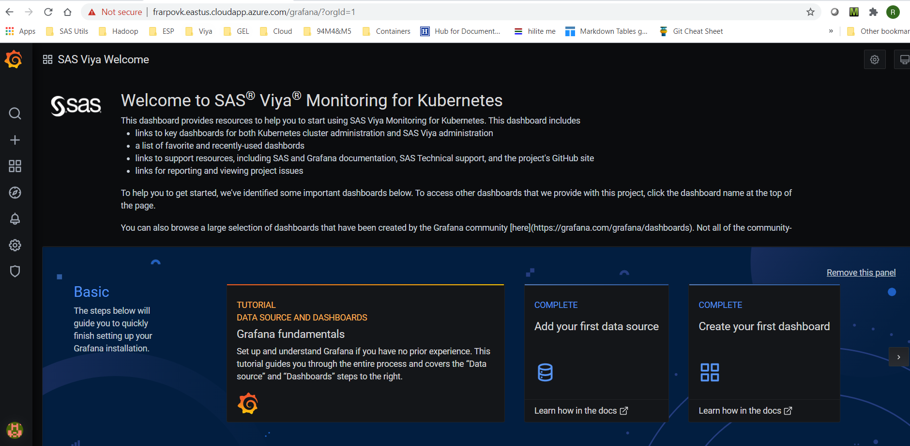

# Deploy SAS Viya Monitoring and logging in AKS (OPTIONAL)

* [Introduction](#introduction)
* [Preparation](#preparation)
* [Deploy Monitoring tools](#deploy-monitoring-tools)
* [Deploy Logging tools](#deploy-logging-tools)
* [Optional : remove the monitoring tools](#optional--remove-the-monitoring-tools)
* [Optional : remove the logging tools](#optional--remove-the-logging-tools)
* [Troubleshooting](#troubleshooting)
* [Navigation](#navigation)

## Introduction

In this optional hands-on, we want to leverage the [SAS Viya Monitoring for Kubernetes](https://github.com/sassoftware/viya4-monitoring-kubernetes) scripts and customization options to deploy monitoring, alerts, and log aggregation for SAS Viya 4.x.

The monitoring solution is based on opensource tools such as [Prometheus](https://prometheus.io/docs/introduction/overview/), [Grafana](https://grafana.com/) and [Alert Manager](https://prometheus.io/docs/alerting/latest/alertmanager/).

The logging solution is also based on opensource tools and includes the EFK stack ([Elasticsearch](https://www.elastic.co/elasticsearch/), [Fluent Bit](https://fluentbit.io/) and [Kibana](https://www.elastic.co/kibana)).

Monitoring and logging may be deployed independently or together. There are no hard dependencies between the two.

Note that, instead, in the Azure Cloud you could rely on the integrated **Azure Monitoring services** and especially with the AKS add-ons.
If you want to know more about it and even try it by yourself visit this [page](https://gitlab.sas.com/GEL/workshops/PSGEL260-sas-viya-4.0.1-administration/-/blob/master/04_Observability/04_031_Enabling_Azure_Monitor.md) from the GEL Administration VLE.

## Preparation

* Clone the project

    ```bash
    cd ~/clouddrive/project/
    git clone https://github.com/sassoftware/viya4-monitoring-kubernetes.git

    # Instead of being at the mercy of the latest changes, we pin to a specific version
    cd ~/clouddrive/project/viya4-monitoring-kubernetes/
    git fetch --all
    MONITORING_TAG=1.0.2

    git checkout tags/${MONITORING_TAG}

    ```

* Copy the azure samples and set USER_DIR

    ```bash
    cd ~/clouddrive/project/viya4-monitoring-kubernetes/
    # clean up
    rm -Rf ~/clouddrive/project/viya4-monitoring-kubernetes/gel/
    # create a gel folder in monitoring
    mkdir -p ~/clouddrive/project/viya4-monitoring-kubernetes/gel/

    # copy azure samples
    cp -R ~/clouddrive/project/viya4-monitoring-kubernetes/samples/azure-deployment/* \
          ~/clouddrive/project/viya4-monitoring-kubernetes/gel/
    export USER_DIR=~/clouddrive/project/viya4-monitoring-kubernetes/gel
    ```

## Deploy Monitoring tools

* Copy the user.env sample

    ```bash
    # copy user.env
    cp ~/clouddrive/project/viya4-monitoring-kubernetes/monitoring/user.env \
         ~/clouddrive/project/viya4-monitoring-kubernetes/gel/
    ```

* Then edit ```$USER_DIR/monitoring/user-values-prom-operator.yaml``` to replace host.cluster.example.com with our ingress host.

* Either manually

    Open the file in the Azure Shell editor

    ```sh
    code $USER_DIR/monitoring/user-values-prom-operator.yaml
    ```

    Replace manually all occurences of host.mycluster.example.com with our ingress host.

    ```yaml
    # Place overrides for the Prometheus Operator Helm Chart Here

    # Prometheus Operator Helm Chart
    # https://https://github.com/prometheus-community/helm-charts/tree/main/charts/kube-prometheus-stack
    #
    # CRDs
    # https://github.com/coreos/prometheus-operator/blob/master/Documentation/api.md
    #
    # Default Values
    # https://github.com/prometheus-community/helm-charts/blob/main/charts/kube-prometheus-stack/values.yaml

    # Sample ingress configuration
    # NOTE: Edit hostnames and ingress port

    prometheus:
    service:
        type: ClusterIP
        nodePort: null
    ingress:
        enabled: true
        annotations:
        kubernetes.io/ingress.class: nginx
        hosts:
        - host.mycluster.example.com
        paths:
        - /prometheus
    prometheusSpec:
        routePrefix: /prometheus
        externalUrl: http://host.mycluster.example.com/prometheus
        storageSpec:
        volumeClaimTemplate:
            spec:
            storageClassName: azuredisk-v4m

    alertmanager:
    service:
        type: ClusterIP
        nodePort: null
    ingress:
        enabled: true
        annotations:
        kubernetes.io/ingress.class: nginx
        hosts:
        - host.mycluster.example.com
        paths:
        - /alertmanager
    alertmanagerSpec:
        routePrefix: /alertmanager
        externalUrl: http://host.mycluster.example.com/alertmanager
        storage:
        volumeClaimTemplate:
            spec:
            storageClassName: azuredisk-v4m

    grafana:
    "grafana.ini":
        server:
        protocol: http
        domain: host.mycluster.example.com
        root_url: http://host.mycluster.example.com/grafana
        serve_from_sub_path: true
    service:
        type: ClusterIP
        nodePort: null
    ingress:
        enabled: true
        hosts:
        - host.mycluster.example.com
        path: /grafana
    testFramework:
        enabled: false
    persistence:
        storageClassName: azuredisk-v4m
    ```yaml

* Or automatically (with ansible)

    ```bash
    # replace externalUrl
    ansible localhost -m replace -a "path=~/clouddrive/project/viya4-monitoring-kubernetes/gel/monitoring/user-values-prom-operator.yaml regexp='^    externalUrl: http://host.mycluster.example.com' replace='    externalUrl: http://${STUDENT}vk.$(cat ~/azureregion.txt).cloudapp.azure.com'" --diff

    # replace host
    ansible localhost -m replace -a "path=~/clouddrive/project/viya4-monitoring-kubernetes/gel/monitoring/user-values-prom-operator.yaml regexp='^    - host.mycluster.example.com' replace='    - ${STUDENT}vk.$(cat ~/azureregion.txt).cloudapp.azure.com'" --diff

    # replace root_url
    ansible localhost -m replace -a "path=~/clouddrive/project/viya4-monitoring-kubernetes/gel/monitoring/user-values-prom-operator.yaml regexp='^      root_url: http://host.mycluster.example.com' replace='      root_url: http://${STUDENT}vk.$(cat ~/azureregion.txt).cloudapp.azure.com'" --diff
    ```

* Create the "azuredisk-v4m" storage class

    We use the sample for azure which refers to the "azuredisk-v4m" storage class. So we need to create it.

    ```bash
    # copy the "azuredisk-v4m" storage class manifest
    cp -R ~/clouddrive/project/viya4-monitoring-kubernetes/samples/azure-deployment/azuredisk-v4m.yaml ~/clouddrive/project/viya4-monitoring-kubernetes/gel/monitoring/
    # create the storage class for the monitoring and logging tools
    kubectl apply -f ~/clouddrive/project/viya4-monitoring-kubernetes/gel/monitoring/azuredisk-v4m.yaml
    ```

* Deploy the monitoring tool

    ```bash
    export USER_DIR=~/clouddrive/project/viya4-monitoring-kubernetes/gel
    export GRAFANA_ADMIN_PASSWORD="lnxsas"
    ~/clouddrive/project/viya4-monitoring-kubernetes/monitoring/bin/deploy_monitoring_cluster.sh
    ```

* If you see something like in the screenshot below, it means that the monitoring project was successfully deployed in the cluster.

    

* Temporary fix to allow the push gateway to start in our Viya namespace

    ```bash
    export USER_DIR=~/clouddrive/project/viya4-monitoring-kubernetes/gel
    cp ~/clouddrive/project/viya4-monitoring-kubernetes/monitoring/user-values-pushgateway.yaml $USER_DIR/monitoring
    echo "tolerations:" > $USER_DIR/monitoring/user-values-pushgateway.yaml
    echo "  - effect: NoSchedule" >> $USER_DIR/monitoring/user-values-pushgateway.yaml
    echo "    key: workload.sas.com/class" >> $USER_DIR/monitoring/user-values-pushgateway.yaml
    echo "    value: stateful" >> $USER_DIR/monitoring/user-values-pushgateway.yaml
    ```

* Now, lets deploy the Viya monitoring

    ```bash
    VIYA_NS=test ~/clouddrive/project/viya4-monitoring-kubernetes/monitoring/bin/deploy_monitoring_viya.sh
    ```

* If you see something like in the screenshot below, it means that the monitoring project was successfully deployed in our viya namespace.

    

* Validate : run the code below and click on the links

    ```bash
    echo "open grafana : https://${STUDENT}vk.$(cat ~/azureregion.txt).cloudapp.azure.com/grafana"
    echo "open prometheus : https://${STUDENT}vk.$(cat ~/azureregion.txt).cloudapp.azure.com/prometheus"
    echo "open alertmanager : https://${STUDENT}vk.$(cat ~/azureregion.txt).cloudapp.azure.com/alertmanager"
    ```

* When you open Grafana, you should see something like :

    

## Deploy Logging tools

* Create a dir for the logging tools

    ```bash
    mkdir -p ~/clouddrive/project/viya4-monitoring-kubernetes/gel/logging
    ```

* Copy the azure sample

    ```bash
    cp -R ~/clouddrive/project/viya4-monitoring-kubernetes/samples/azure-deployment/logging ~/clouddrive/project/viya4-monitoring-kubernetes/gel
    export USER_DIR=~/clouddrive/project/viya4-monitoring-kubernetes/gel
    ```

* Copy the user.env sample

    ```bash
    cp ~/clouddrive/project/viya4-monitoring-kubernetes/logging/user.env ~/clouddrive/project/viya4-monitoring-kubernetes/gel/logging
    ```

<!-- * Add the 3 lines below in the logging/user.env file (because the script uses uuidgen which is not installed in the Azure shell)

    ```log
    ES_KIBANASERVER_PASSWD="lnxsas"
    ES_LOGCOLLECTOR_PASSWD="lnxsas"
    ES_METRICGETTER_PASSWD="lnxsas"
    ```

* You can also do it by running the block of commands below

    ```sh
    echo "ES_KIBANASERVER_PASSWD=\"lnxsas\"" > ~/clouddrive/project/viya4-monitoring-kubernetes/gel/logging/user.env
    echo "ES_LOGCOLLECTOR_PASSWD=\"lnxsas\"" >> ~/clouddrive/project/viya4-monitoring-kubernetes/gel/logging/user.env
    echo "ES_METRICGETTER_PASSWD=\"lnxsas\"" >> ~/clouddrive/project/viya4-monitoring-kubernetes/gel/logging/user.env
    ``` -->

* Preset the Kibana admin password

    ```bash
    echo "ES_ADMIN_PASSWD=\"lnxsas\"" >> ~/clouddrive/project/viya4-monitoring-kubernetes/gel/logging/user.env
    ```

* Then edit ```$USER_DIR/logging/user-values-elasticsearch-open.yaml``` to replace host.cluster.example.com with ingress host

* Either manually

    ```sh
    code $USER_DIR/logging/user-values-elasticsearch-open.yaml
    ```

* Or automatically

    ```yaml
    cat > ~/clouddrive/project/viya4-monitoring-kubernetes/gel/logging/user-values-elasticsearch-open.yaml << EOF
    kibana:
        extraEnvs:
        # Needed for path-based ingress
        - name: SERVER_BASEPATH
          value: /kibana

        - name: ELASTICSEARCH_USERNAME
          valueFrom:
            secretKeyRef:
              name: internal-user-kibanaserver
              key: username

        - name: ELASTICSEARCH_PASSWORD
          valueFrom:
            secretKeyRef:
              name: internal-user-kibanaserver
              key: password

        service:
            type: ClusterIP
            nodePort: null

        ingress:
            annotations:
                kubernetes.io/ingress.class: nginx
                nginx.ingress.kubernetes.io/affinity: "cookie"
                nginx.ingress.kubernetes.io/ssl-redirect: "false"
                nginx.ingress.kubernetes.io/configuration-snippet: |
                    rewrite (?i)/kibana/(.*) /\$1 break;
                    rewrite (?i)/kibana$ / break;
                nginx.ingress.kubernetes.io/rewrite-target: /kibana
            enabled: true
            hosts:
            - ${STUDENT}vk.$(cat ~/azureregion.txt).cloudapp.azure.com/kibana
    EOF
    ```

<!-- for cheatcodes as we kept the yaml formating insted of bash
    ```bash
    cat > ~/clouddrive/project/viya4-monitoring-kubernetes/gel/logging/user-values-elasticsearch-open.yaml << EOF
    kibana:
        extraEnvs:
        # Needed for path-based ingress
        - name: SERVER_BASEPATH
          value: /kibana

        - name: ELASTICSEARCH_USERNAME
          valueFrom:
            secretKeyRef:
              name: internal-user-kibanaserver
              key: username

        - name: ELASTICSEARCH_PASSWORD
          valueFrom:
            secretKeyRef:
              name: internal-user-kibanaserver
              key: password

        service:
            type: ClusterIP
            nodePort: null

        ingress:
            annotations:
                kubernetes.io/ingress.class: nginx
                nginx.ingress.kubernetes.io/affinity: "cookie"
                nginx.ingress.kubernetes.io/ssl-redirect: "false"
                nginx.ingress.kubernetes.io/configuration-snippet: |
                    rewrite (?i)/kibana/(.*) /\$1 break;
                    rewrite (?i)/kibana$ / break;
                nginx.ingress.kubernetes.io/rewrite-target: /kibana
            enabled: true
            hosts:
            - ${STUDENT}vk.$(cat ~/azureregion.txt).cloudapp.azure.com/kibana
    EOF
    ```
-->

* Deploy the logging tool

    ```bash
    export USER_DIR=~/clouddrive/project/viya4-monitoring-kubernetes/gel
    ~/clouddrive/project/viya4-monitoring-kubernetes/logging/bin/deploy_logging_open.sh
    ```

* At the end you should see something like:

  

* Validate : run the code below and click on the links

    ```bash
    echo "open http://${STUDENT}vk.$(cat ~/azureregion.txt).cloudapp.azure.com/kibana/"
    ```

* Check the log dashboards, you should be able to view something like :

    

## Optional : remove the monitoring tools

* remove the monitoring infrastructure

    ```sh
    # Optional: Remove SAS Viya monitoring
    # Run this section once per Viya namespace
    export VIYA_NS=test
    ~/clouddrive/project/viya4-monitoring-kubernetes/monitoring/bin/remove_monitoring_viya.sh
    # Remove cluster monitoring
    ~/clouddrive/project/viya4-monitoring-kubernetes/monitoring/bin/remove_monitoring_cluster.sh
    # delete the namespace
    kubectl delete ns monitoring
    ```

Removing cluster monitoring does not remove persistent volume claims by default. A re-install after removal should retain existing data. Manually delete the PVCs or the namespace to delete previously collected monitoring data.

## Optional : remove the logging tools

* Remove Kibana

    ```sh
    # uninstall logging
    export USER_DIR=~/clouddrive/project/viya4-monitoring-kubernetes/gel
    ~/clouddrive/project/viya4-monitoring-kubernetes/logging/bin/remove_logging_open.sh
    #then delete namespace
    kubectl delete ns logging
    ```

## Troubleshooting

* Expose kube-proxy Metrics ([source](https://github.com/sassoftware/viya4-monitoring-kubernetes/tree/master/monitoring))

    Some clusters are deployed with the kube-proxy metrics listen address set to 127.0.0.1, which prevents Prometheus from collecting metrics. To enable kube-proxy metrics, which are used in the Kubernetes / Proxy dashboard, run this command:

    ```sh
    # Change metricsBindAddress to 0.0.0.0:10249
    kubectl create configmap kube-proxy --from-literal=metricsBindAddress=0.0.0.0:10249 -n kube-system
    # Restart all kube-proxy pods
    kubectl delete po -n kube-system -l component=kube-proxy
    # Pods will automatically be recreated
    ```

## Navigation

<!-- startnav -->
* [01 Introduction / 01 031 Booking a Lab Environment for the Workshop](/01_Introduction/01_031_Booking_a_Lab_Environment_for_the_Workshop.md)
* [01 Introduction / 01 032 Assess Readiness of Lab Environment](/01_Introduction/01_032_Assess_Readiness_of_Lab_Environment.md)
* [01 Introduction / 01 033 CheatCodes](/01_Introduction/01_033_CheatCodes.md)
* [02 Kubernetes and Containers Fundamentals / 02 131 Learning about Namespaces](/02_Kubernetes_and_Containers_Fundamentals/02_131_Learning_about_Namespaces.md)
* [03 Viya 4 Software Specifics / 03 011 Looking at a Viya 4 environment with Visual Tools DEMO](/03_Viya_4_Software_Specifics/03_011_Looking_at_a_Viya_4_environment_with_Visual_Tools_DEMO.md)
* [03 Viya 4 Software Specifics / 03 051 Create your own Viya order](/03_Viya_4_Software_Specifics/03_051_Create_your_own_Viya_order.md)
* [03 Viya 4 Software Specifics / 03 056 Getting the order with the CLI](/03_Viya_4_Software_Specifics/03_056_Getting_the_order_with_the_CLI.md)
* [04 Pre Requisites / 04 081 Pre Requisites automation with Viya4-ARK](/04_Pre-Requisites/04_081_Pre-Requisites_automation_with_Viya4-ARK.md)
* [05 Deployment tools / 05 121 Setup a Windows Client Machine](/05_Deployment_tools/05_121_Setup_a_Windows_Client_Machine.md)
* [06 Deployment Steps / 06 031 Deploying a simple environment](/06_Deployment_Steps/06_031_Deploying_a_simple_environment.md)
* [06 Deployment Steps / 06 051 Deploying Viya with Authentication](/06_Deployment_Steps/06_051_Deploying_Viya_with_Authentication.md)
* [06 Deployment Steps / 06 061 Deploying in a second namespace](/06_Deployment_Steps/06_061_Deploying_in_a_second_namespace.md)
* [06 Deployment Steps / 06 071 Removing Viya deployments](/06_Deployment_Steps/06_071_Removing_Viya_deployments.md)
* [06 Deployment Steps / 06 081 Deploying a programing only environment](/06_Deployment_Steps/06_081_Deploying_a_programing-only_environment.md)
* [07 Deployment Customizations / 07 021 Configuring SASWORK](/07_Deployment_Customizations/07_021_Configuring_SASWORK.md)
* [07 Deployment Customizations / 07 051 Adding a local registry to k8s](/07_Deployment_Customizations/07_051_Adding_a_local_registry_to_k8s.md)
* [07 Deployment Customizations / 07 052 Using mirror manager to populate the local registry](/07_Deployment_Customizations/07_052_Using_mirror_manager_to_populate_the_local_registry.md)
* [07 Deployment Customizations / 07 053 Deploy from local registry](/07_Deployment_Customizations/07_053_Deploy_from_local_registry.md)
* [07 Deployment Customizations / 07 091 Configure SAS ACCESS Engine](/07_Deployment_Customizations/07_091_Configure_SAS_ACCESS_Engine.md)
* [07 Deployment Customizations / 07 101 Configure SAS ACCESS TO HADOOP](/07_Deployment_Customizations/07_101_Configure_SAS_ACCESS_TO_HADOOP.md)
* [07 Deployment Customizations / 07 102 Parralel loading with EP for Hadoop](/07_Deployment_Customizations/07_102_Parralel_loading_with_EP_for_Hadoop.md)
* [11 Azure AKS Deployment / 11 011 Creating an AKS Cluster](/11_Azure_AKS_Deployment/11_011_Creating_an_AKS_Cluster.md)
* [11 Azure AKS Deployment / 11 041 Performing Prereqs in AKS](/11_Azure_AKS_Deployment/11_041_Performing_Prereqs_in_AKS.md)
* [11 Azure AKS Deployment / 11 042 Deploying Viya 4 on AKS](/11_Azure_AKS_Deployment/11_042_Deploying_Viya_4_on_AKS.md)
* [11 Azure AKS Deployment / 11 043 Deploy a second namespace in AKS](/11_Azure_AKS_Deployment/11_043_Deploy_a_second_namespace_in_AKS.md)
* [11 Azure AKS Deployment / 11 051 CAS Customizations](/11_Azure_AKS_Deployment/11_051_CAS_Customizations.md)
* [11 Azure AKS Deployment / 11 061 Install monitoring and logging](/11_Azure_AKS_Deployment/11_061_Install_monitoring_and_logging.md)**<-- you are here**
* [11 Azure AKS Deployment / 11 091 Deleting the AKS Cluster](/11_Azure_AKS_Deployment/11_091_Deleting_the_AKS_Cluster.md)
* [11 Azure AKS Deployment / 11 099 Fast track with cheatcodes](/11_Azure_AKS_Deployment/11_099_Fast_track_with_cheatcodes.md)
<!-- endnav -->
